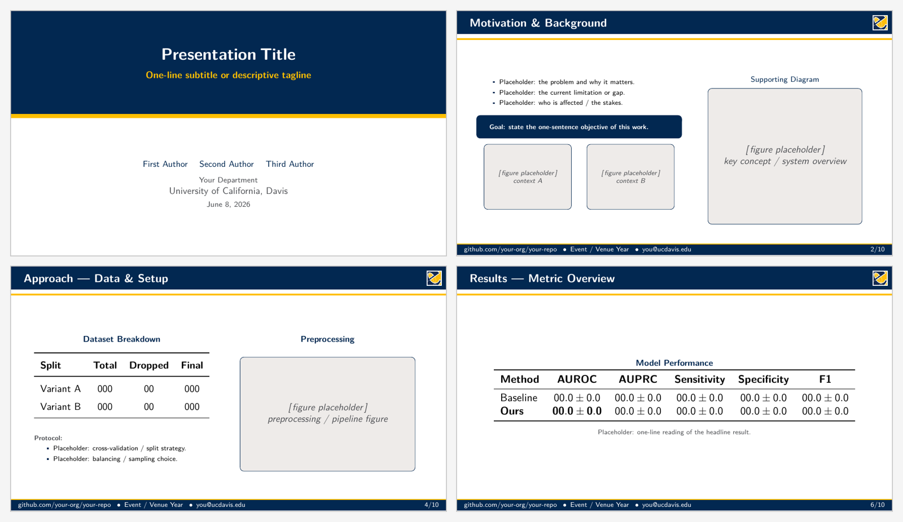

# UC Davis Slides Template (LaTeX Beamer, 16:9)

A clean, ready-to-edit **LaTeX Beamer presentation** in the UC Davis house style.
Drop in your title, figures, and text and you have a talk-ready deck. Everything
in this repo is **placeholder content** (dummy bullets, placeholder figure boxes,
filler tables) so nothing needs to be deleted before you start — just replace.



---

## Features

- **16:9 widescreen** (`aspectratio=169`) Beamer deck.
- **UC Davis palette** — Aggie Blue + Aggie Gold, with a gold accent rule under
  every frame title and full-bleed blue **section-divider** slides.
- **College of Engineering logo** in the top-right of every content slide
  (header bar only — not on the title, dividers, or thank-you slide).
- **Placeholder figure boxes** via a one-line `\placeholderfig{}` command — no
  image files required to start.
- **Self-contained**: a single `.tex` file plus the bundled `coe_logo.jpg`.
  Compiles on Overleaf or any local TeX Live with **standard pdfLaTeX** — no
  `fontspec`, no extra installs.
- Reusable helpers: `\highlightbox{}` (goal/takeaway callout) and `\coemark`
  (white-bordered COE logo).

---

## Quick start

> **Compile with pdfLaTeX, and run it twice.** The corner logo and title-page
> band use TikZ `remember picture` overlays, which need a second pass to land in
> the right place.

### Overleaf (easiest)
1. Upload this folder (or import the repo) to a new Overleaf project.
2. **Menu → Settings → Compiler → pdfLaTeX**.
3. Compile `presentation_template.tex` (Overleaf runs the needed passes
   automatically).

### Local
Requires a TeX distribution (TeX Live / MacTeX):

```bash
latexmk -pdf presentation_template.tex
# or, manually (two passes):
pdflatex presentation_template.tex
pdflatex presentation_template.tex
```

---

## What to edit

All edit points live in the preamble of `presentation_template.tex`.

| Element | Where | Notes |
|---|---|---|
| Title | `\title{...}` | Title-page blue band |
| Subtitle | `\subtitle{...}` | Gold tagline under the title |
| Authors | `\author{... \and ... \and ...}` | `\and` separates authors |
| Department / institution | `\institute{...}` | Two centered lines |
| Footer (URL, event, email) | `\footercontent{...}` | Left content / right page number |
| Header logo | `coe_logo.jpg` | Top-right of content slides; swap in your own |
| Body content | inside `\begin{frame}` | Replace all `Placeholder …` text |
| Sections | `\section{...}` | Each one auto-generates a blue divider slide |

### Placeholder figures

```latex
\placeholderfig{<label>}          % default height
\placeholderfig[<height>]{<label>}  % custom height, e.g. [5cm]
```

Renders a bordered grey box with a centered label. Replace each one with
`\includegraphics[...]{your_figure.png}` when your real figures are ready.

### Changing the colors

Brand colors are defined near the top of the preamble:

```latex
\definecolor{aggieblue}{HTML}{022851}
\definecolor{aggiegold}{HTML}{FFBF00}
```

Edit those `\definecolor` lines to recolor the whole deck.

---

## Files

| File | Purpose |
|---|---|
| `presentation_template.tex` | The slides source — **edit this** |
| `coe_logo.jpg` | College of Engineering mark shown in content-slide headers |
| `preview.png` | Rendered preview shown above |
| `presentation_template.pdf` | Compiled example output |

---

## License

Released under the **MIT License**. Replace `coe_logo.jpg` with your own
institution's artwork before redistributing outside UC Davis.
